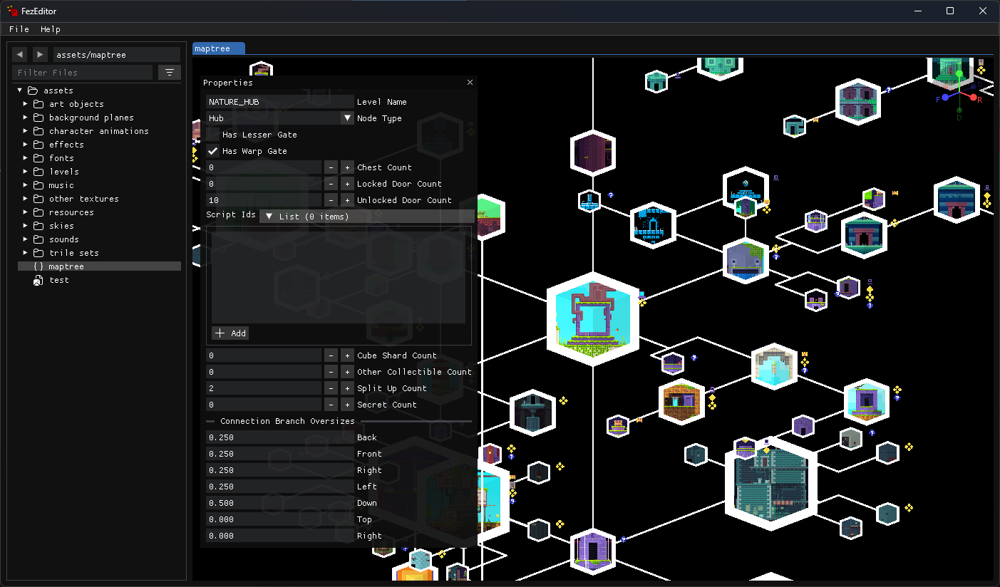
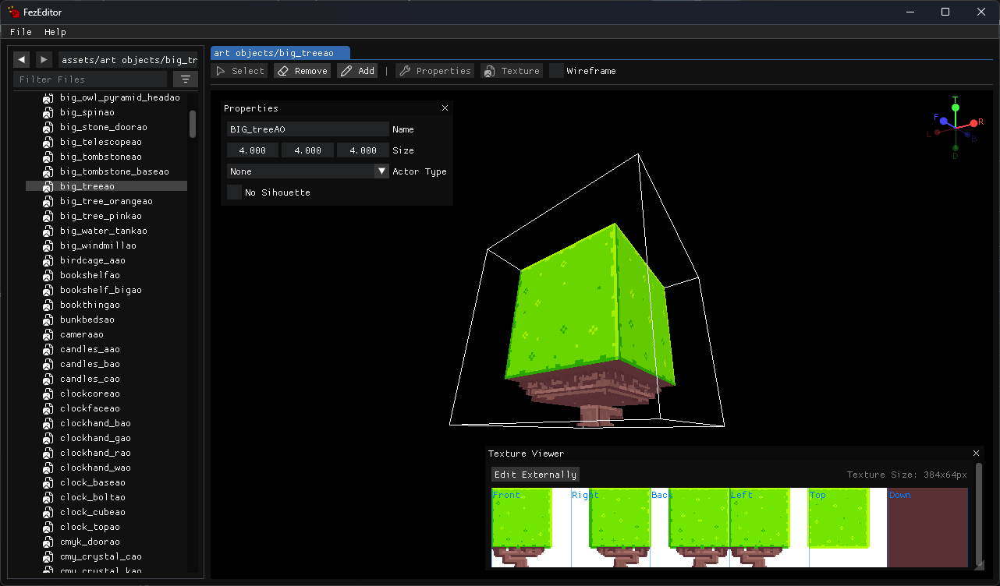

#  FEZEditor

## A Modding Tool for FEZ



*Editor for World Map (live and interactive)*



*Editor for trixel models (Art Objects and Trile Sets)*

## Overview

FEZEditor is a GUI tool created for managing and modding FEZ's assets.

> [!WARNING]
> FEZEditor is in a development state, and only suitable for use by modding developers.
>
> Expect that some features will be missing or will not work at all.

## Cloning

Clone the repository with flag `--recurse-submodules`.

If you have already cloned the project, use this:

```bash
git submodule update --init
```

## Building

### Prerequisites

- [.NET 9 SDK](https://dotnet.microsoft.com/download/dotnet/9)
- `fxc.exe` for shader compilation (see below)

### Shader Compiler (fxc.exe)

The build requires `fxc.exe` to compile HLSL shaders. You can provide it in one of two ways:

**Windows:**

- Place `fxc.exe` in the `FXC/` directory, **or**
- Install the [DirectX SDK (June 2010)](https://archive.org/details/dxsdk_jun10) — the build will locate it automatically via `%DXSDK_DIR%`

**Linux / macOS (via Wine):**

- Place `fxc.exe` in the `FXC/` directory and install Wine with `winetricks d3dcompiler_43`, **or**
- Install the DirectX SDK under Wine with `winetricks dxsdk_jun2010`

### Building

```bash
dotnet build FezEditor.sln
```

To build a release binary:

```bash
dotnet publish FezEditor/FezEditor.csproj -c Release
```

> [!NOTE]
> In JetBrains Rider, ReSharper Build must be disabled to ensure content is always up to date on every project build.
> Go to `Settings > Build, Execution, Deployment > Toolset and Build` and uncheck `Use ReSharper Build`.

## Features

### Asset Management

* Opening PAK files (readonly mode)
* Opening folders with extracted assets (XNB and FEZRepacker formats are supported)
* Extracting assets from PAK

### Asset Editing

* `JadeEditor`: World Map
* `DiezEditor`: Tracked Songs
* `PoEditor`: Static text (localization files)
* `SallyEditor`: Save files (PC format only)
* `ZuEditor`: SpriteFonts
* `ChrisEditor`: ArtObjects and TrileSets

### Documentation

Refer to [FEZModding Wiki](https://fezmodding.github.io/wiki/game/) for FEZ assets specifications (incomplete).

### Contributing

**Contributions are welcome!**
Whether it's bug fixes, implementation improvements or suggestions, your help will be greatly appreciated.

### Credits

This project uses:

* [FNA](https://github.com/FNA-XNA/FNA) as main app framework.
* [FEZRepacker](https://github.com/FEZModding/FEZRepacker) for taking on the heavy lifting of reading and converting assets.
* [ImGui.NET](https://github.com/ImGuiNET/ImGui.NET) for creating complex editor UI.

## Special thanks to

* [FEZModding folks](https://github.com/FEZModding) for providing modding materials and tools.
* [Godot contributors](https://github.com/godotengine/godot) for saving hours of headaches when creating a PoC.